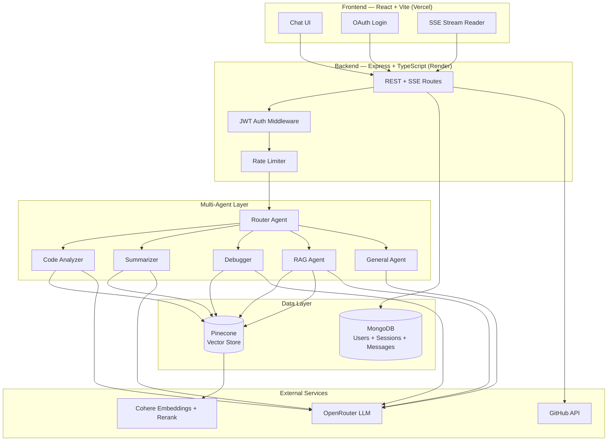
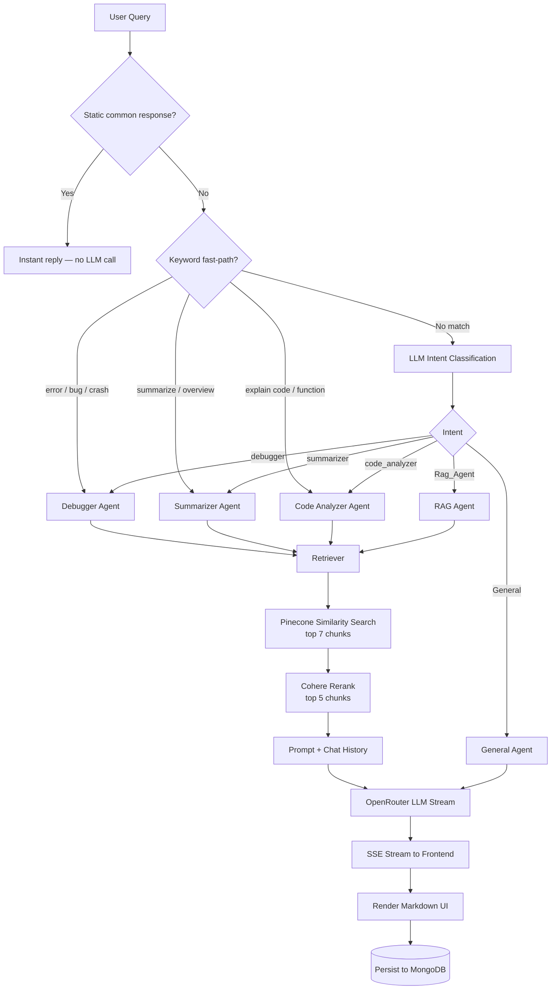
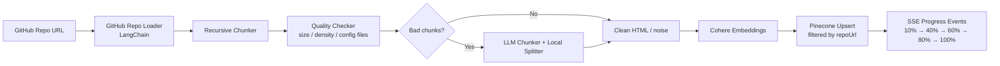

# CodeLens AI — GitHub Repository Explainer

> **Understand any GitHub repository through intelligent, multi-agent conversation.**

CodeLens AI is a full-stack RAG-powered application that ingests public GitHub repositories, indexes them into a vector database, and routes user questions to specialized AI agents — each tuned for code analysis, summarization, debugging, or general programming help.

**Live Demo**

- Frontend: `[https://github-repository-explainer-hpr3.vercel.app](https://github-repository-explainer-hpr3.vercel.app)` *(Vercel)*
- Backend API: `[https://github-repository-explainer.onrender.com](https://github-repository-explainer.onrender.com)` *(Render)*

> ⚠️ **Note:** The backend runs on Render's free tier, which spins down after periods of inactivity. The **first request** after idle time may take **30–50 seconds** to respond while the server wakes up — this is expected and not a bug. Subsequent requests are fast.

---


## Highlights


| Area                              | What I built                                                                                              |
| --------------------------------- | --------------------------------------------------------------------------------------------------------- |
| **Multi-agent orchestration**     | Router agent with keyword fast-paths + LLM intent classification → 5 specialized downstream agents        |
| **Production RAG pipeline**       | GitHub ingestion → smart chunking → Cohere embeddings → Pinecone → Cohere reranking                       |
| **Real-time UX**                  | Server-Sent Events (SSE) for streaming chat responses and ingestion progress                              |
| **Full-stack auth & persistence** | Google + GitHub OAuth, JWT sessions, MongoDB chat history                                                 |
| **Production safeguards**         | Rate limiting, prompt-injection defense, response caching, LLM fallback via OpenRouter                    |
| **Live deployment**               | MongoDB Atlas + Render (backend) + Vercel (frontend), with production OAuth callbacks and env-driven CORS |


---


## System Architecture




---


## Agent Routing Flow

Every chat message passes through a **Router Agent** that decides which specialist handles the query.




---


## Repository Ingestion Pipeline

When a user pastes a GitHub URL, the backend indexes the repo before chat begins.




**Stages:** `loading` → `chunking` → `cleaning` → `storing` → `done`

Re-ingesting a repo clears stale vectors and invalidates cached answers for that repository.

---


## Tech Stack


### Frontend


| Technology                          | Purpose                    |
| ----------------------------------- | -------------------------- |
| React 19 + TypeScript               | UI framework               |
| Vite                                | Build tool & dev server    |
| React Router v7                     | Client-side routing        |
| React Markdown + Syntax Highlighter | Rich AI response rendering |
| jsPDF                               | Export chat as PDF         |
| Web Speech API                      | Voice input                |
| Axios + Fetch SSE                   | API communication          |


### Backend


| Technology          | Purpose                                          |
| ------------------- | ------------------------------------------------ |
| Node.js + Express 5 | REST API & SSE endpoints                         |
| TypeScript          | Type-safe server code                            |
| LangChain           | Document loaders, chunking, Pinecone integration |
| Passport.js         | Google + GitHub OAuth, JWT strategy              |
| Mongoose            | MongoDB ODM                                      |
| express-rate-limit  | Abuse protection                                 |


### AI / ML Services


| Service        | Role                                                       |
| -------------- | ---------------------------------------------------------- |
| **OpenRouter** | LLM inference with automatic free-model fallback           |
| **Cohere**     | `embed-english-v3.0` embeddings + `rerank-english-v3.0`    |
| **Pinecone**   | Vector store (index: `github`, metadata filter: `repoUrl`) |


### Infrastructure


| Service           | Deployment                                                       |
| ----------------- | ---------------------------------------------------------------- |
| **Vercel**        | Frontend (static SPA, SPA client-side routing via `vercel.json`) |
| **Render**        | Backend API (free tier, cold-starts after inactivity)            |
| **MongoDB Atlas** | User accounts, sessions, message history                         |


---


## Features


### Core

- Paste any public GitHub repo URL → automatic ingestion with live progress bar
- Ask questions about architecture, files, functions, bugs, or get a repo overview
- Token-by-token streaming responses (SSE)
- Conversation memory within sessions (last 15 messages, 4K char budget)


### Chat Experience

- Multi-session sidebar (create, rename, star, delete, search)
- Group sessions by **date** (Today / Yesterday / Older) or view ungrouped
- Star up to 3 sessions for quick access, pinned above the rest
- Edit & retry messages, abort in-flight streams, retry interrupted/errored responses
- Paste large code snippets as collapsible attachments with a preview modal
- Voice input (browser Speech Recognition) with live interim transcript
- Copy message / export full chat as PDF
- Dark & light theme with persisted preference (survives logout/login)
- Collapsible sidebar with pinned user profile footer
- Soft limit (80 msgs) & hard limit (100 msgs) per session, with in-chat warning banners
- Toast notifications for key actions (star/unstar, delete, errors)


### Security & Reliability

- JWT-protected routes
- Prompt injection detection + delimited user content wrapping
- Secret/credential paste warnings in AI responses
- **Two-tier caching**: a static common-response layer answers greetings/FAQs instantly (repo-aware — knows if a repo is already ingested), and a query-level LLM response cache (24h TTL) avoids redundant model calls for repeated questions, invalidated automatically on re-ingestion.
- LLM service cooldown + OpenRouter model fallback
- Rate limits: 15 chat requests / 15 min, 5 ingests / 15 min
- GitHub-only scope — pasting a GitLab, Bitbucket, SourceForge, or Codeberg URL surfaces a clear message instead of silently failing.


### Auth

- Sign in with **Google** or **GitHub**
- GitHub OAuth stores access token for fetching user's repos
- Stateless JWT sessions issued on successful OAuth callback

---


## Project Structure

```
Github_Repo_Explainer/
├── Frontend/                    # React SPA → deploy to Vercel
│   ├── vercel.json              # SPA rewrite rule for client-side routing
│   └── src/
│       ├── Pages/
│       │   ├── Home/            # Landing page
│       │   ├── Auth/            # OAuth login + callback
│       │   └── Chat/            # Main chat interface
│       ├── Components/          # Sidebar, ChatHeader, ChatInput, MessageBubble,
│       │                        # SessionItem, RenameModal, DeleteModal, SearchModal,
│       │                        # SessionLimitBanner, IngestProgress, CodeBlock, Loader
│       ├── hooks/                # useChatMessages, useIngest, useSessions, useAppInit,
│       │                        # useTheme, useVoiceInput, usePastedFiles, useScrollBehavior
│       └── utils/                # axios instance, pdfExport, useClickOutside
│
└── Backend/                     # Express API → deploy to Render
    └── src/
        ├── AI/
        │   ├── agents/          # Router, Code, Summary, Debugger, RAG, General
        │   ├── Chunking/        # Recursive + quality + LLM chunking pipeline
        │   ├── Loaders/         # GitHub repo loader
        │   ├── retriever/       # Pinecone search + Cohere rerank
        │   ├── vectorStore/     # Pinecone upsert/query
        │   └── embeddings/      # Cohere embeddings
        ├── controllers/         # Chat, Ingest, Auth, Session handlers
        ├── models/              # User & Session Mongoose schemas
        ├── routes/              # API route definitions
        └── utils/               # Cache, rate limiter, prompt guard, SSE helpers
```

---


## API Endpoints


| Method   | Endpoint                                     | Description                                              |
| -------- | -------------------------------------------- | -------------------------------------------------------- |
| `POST`   | `/api/ingest`                                | Ingest GitHub repo (SSE progress)                        |
| `POST`   | `/api/chat`                                  | Send message, stream AI response (SSE)                   |
| `GET`    | `/api/sessions`                              | List user sessions                                       |
| `GET`    | `/api/sessions/:id`                          | Get session + messages                                   |
| `PATCH`  | `/api/sessions/:id`                          | Rename session                                           |
| `PATCH`  | `/api/sessions/:id/star`                     | Star/unstar session                                      |
| `DELETE` | `/api/sessions/:id`                          | Delete session                                           |
| `GET`    | `/api/github/repos`                          | Fetch authenticated user's GitHub repos                  |
| `GET`    | `/api/auth/google`                           | Google OAuth                                             |
| `GET`    | `/api/auth/github`                           | GitHub OAuth                                             |
| `PATCH`  | `/api/sessions/:sessionId/truncate`          | Delete messages after a given point (used by retry/edit) |
| `PATCH`  | `/api/sessions/:sessionId/dismiss-interrupt` | Mark an interrupted-response card as dismissed           |
| `PATCH`  | `/api/sessions/:sessionId/mark-interrupted`  | Flag a message as interrupted when a stream is aborted   |


---


## Environment Variables


### Backend (Render)

```env
# Server
PORT=5001

# Database
mongoDbURL=mongodb+srv://<user>:<password>@cluster0.xxxxx.mongodb.net/Github_Repo_Explainer?retryWrites=true&w=majority

# Auth
JWT_SECRET=your_jwt_secret
GOOGLE_CLIENT_ID=
GOOGLE_CLIENT_SECRET=
GITHUB_CLIENT_ID=
GITHUB_CLIENT_SECRET=

# AI Services
OPENROUTER_API_KEY=
COHERE_API_KEY=
PINECONE_API_KEY=

# GitHub (for repo loading)
GITHUB_ACCESS_TOKEN=

# Used to build OAuth callback + redirect URLs dynamically (no hardcoded localhost)
BACKEND_URL=https://github-repository-explainer.onrender.com
FRONTEND_URL=https://github-repository-explainer-hpr3.vercel.app
```


### Frontend (Vercel)

```env
VITE_API_URL=https://github-repository-explainer.onrender.com
```

> **Note:** Vite environment variables are baked in at **build time**. Changing `VITE_API_URL` in the Vercel dashboard requires a **redeploy** to take effect — simply saving the variable is not enough.

---


## Deployment Guide


### 1. MongoDB Atlas

1. Create a free (M0) cluster
2. **Network Access** → allow `0.0.0.0/0` (Render's IP isn't static)
3. **Database Access** → create a user with `readWrite`/`atlasAdmin` role
4. Copy the connection string into `mongoDbURL`


### 2. Backend → Render

1. Create a new **Web Service** on Render, connect this repo
2. **Root Directory:** `Backend`
3. **Build Command:** `npm install --legacy-peer-deps`
  *(some LangChain packages have conflicting peer dependencies —* `--legacy-peer-deps` *avoids install failures)*
4. **Start Command:** `npx tsx src/index.ts`
5. Add all backend environment variables (see above), using placeholder `localhost` URLs for `BACKEND_URL`/`FRONTEND_URL` initially
6. Deploy, then copy the generated `.onrender.com` URL back into `BACKEND_URL` and redeploy
7. Update OAuth callback URLs in Google Cloud Console & GitHub OAuth App:
  - `https://your-api.onrender.com/api/auth/google/callback`
  - `https://your-api.onrender.com/api/auth/github/callback`
   ⚠️ **Google** supports multiple authorized redirect URIs, so local (`localhost:5001`) and production can coexist. **GitHub OAuth Apps only support a single callback URL** — testing GitHub login locally and in production simultaneously requires two separate GitHub OAuth Apps (dev + prod).


### 3. Frontend → Vercel

1. Import repo, set **Root Directory** to `Frontend`
2. **Framework Preset:** Vite (auto-detected)
3. **Build Command / Output Directory:** left as Vite defaults (`npm run build` / `dist`)
4. Set `VITE_API_URL` to your Render backend URL
5. `vercel.json` (already included in `Frontend/`) handles SPA rewrites so client-side routes like `/auth/callback` don't 404 on direct load:

```json
{
  "rewrites": [{ "source": "/(.*)", "destination": "/index.html" }]
}
```

1. Deploy, then copy the generated `.vercel.app` URL back into the Render `FRONTEND_URL` env var (triggers a backend redeploy) — this keeps CORS and the post-OAuth redirect pointed at the right place.


### 4. Pinecone Setup

1. Create a Pinecone index named `github`
2. Dimension must match Cohere `embed-english-v3.0` (1024)
3. Use serverless or pod-based — both work with `@langchain/pinecone`

---


## Local Development

```bash
# Backend
cd Backend
npm install
cp .env.example .env   # fill in your keys, point mongoDbURL at a local or dev Atlas DB
npm run dev            # http://localhost:5001

# Frontend (separate terminal)
cd Frontend
npm install
npm run dev            # http://localhost:5173
```

> **Tip:** If your local `.env` points `mongoDbURL` at the same database as production, local testing will read/write real user data. Use a separate database name (e.g. append `_DEV`) on the same Atlas cluster to keep local experiments isolated from production data.

---


## Design Decisions


| Decision                                 | Rationale                                                                                                                                  |
| ---------------------------------------- | ------------------------------------------------------------------------------------------------------------------------------------------ |
| **Multi-agent vs single prompt**         | Specialized system prompts produce higher-quality, shorter answers per task type                                                           |
| **Keyword fast-path before LLM routing** | Saves latency & cost on obvious intents (debug, summarize, explain code)                                                                   |
| **Cohere rerank after vector search**    | Improves retrieval precision — similarity alone misses semantic nuance                                                                     |
| **Quality-aware chunking pipeline**      | Rejects noisy/sparse chunks; LLM re-chunking only for large bad chunks (max 8 calls)                                                       |
| **SSE over WebSockets**                  | Simpler infra for one-way streaming; works well with Render's HTTP model                                                                   |
| **OpenRouter free models**               | Cost-effective for portfolio/demo; built-in fallback for reliability                                                                       |
| **Session-scoped repo URL in DB**        | Backend is authoritative source — prevents frontend tampering with repo context                                                            |
| **GitHub-only scope**                    | Pasting a GitLab, Bitbucket, SourceForge, or Codeberg URL surfaces a clear message rather than silently failing or attempting ingestion    |
| **Env-driven URLs everywhere**           | No hardcoded `localhost` in OAuth callbacks, CORS, or API base URL — the same codebase runs locally and in production by swapping env vars |


---


## Known Limitations

- Render's free tier cold-starts after ~15 minutes of inactivity (first request after idle can take 30–50s)
- GitHub OAuth only supports one callback URL per app, so local + production GitHub login can't both be tested without a second OAuth App
- In-memory response cache is per-instance — won't stay consistent if the backend scales to multiple instances (see Future Improvements)

---


## Future Improvements

- [ ] Private repo support via user's GitHub OAuth token
- [ ] Support for non-GitHub sources (GitLab, Bitbucket, arbitrary URLs) beyond the current GitHub-only scope
- [ ] Web-search + verifier agent — cross-checks agent responses against live web results and repo context for higher accuracy
- [ ] Redis cache layer (replace in-memory cache for multi-instance Render)
- [ ] Unit tests for chunking pipeline & router intent logic
- [ ] Uptime monitoring to reduce Render free-tier cold starts

---


## License

MIT