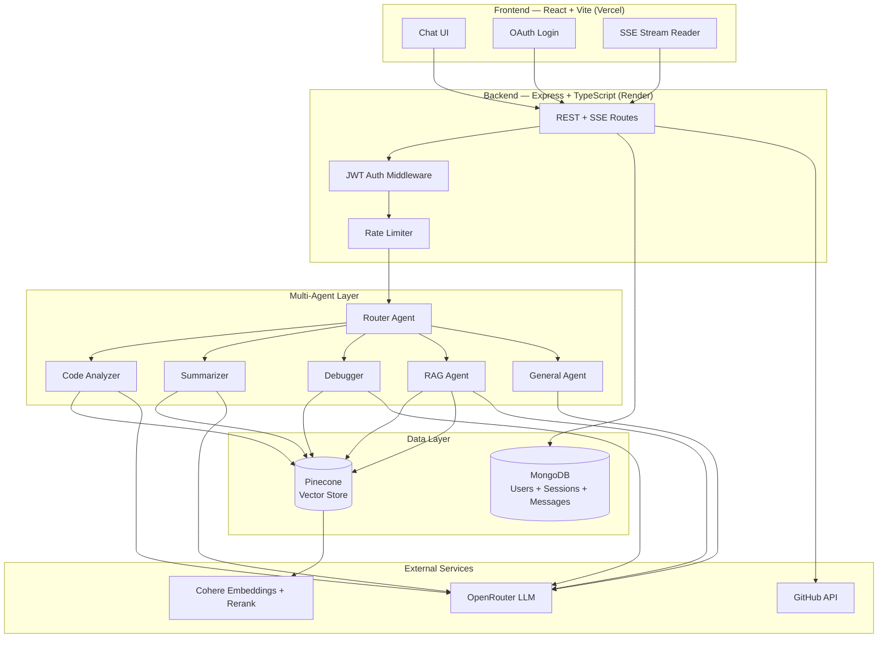
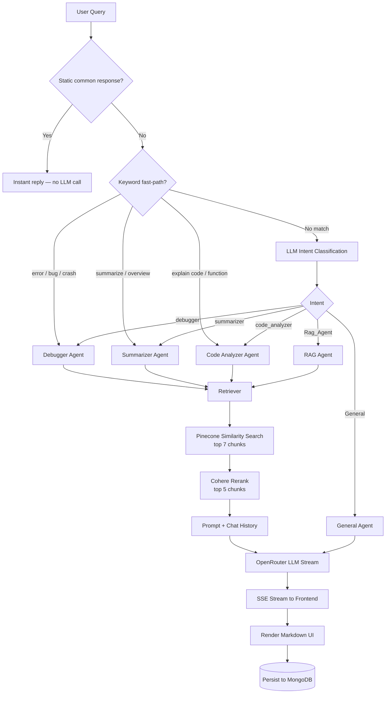
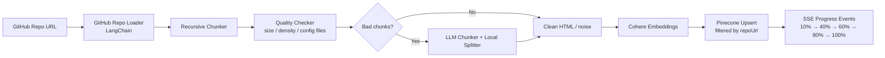

# CodeLens AI — GitHub Repository Explainer

> **Understand any GitHub repository through intelligent, multi-agent conversation.**

CodeLens AI is a full-stack RAG-powered application that ingests public GitHub repositories, indexes them into a vector database, and routes user questions to specialized AI agents — each tuned for code analysis, summarization, debugging, or general programming help.

**Live Demo**
- Frontend: `https://your-app.vercel.app` *(Vercel)*
- Backend API: `https://your-api.onrender.com` *(Render)*

---

## Highlights

| Area | What I built |
|------|----------------|
| **Multi-agent orchestration** | Router agent with keyword fast-paths + LLM intent classification → 5 specialized downstream agents |
| **Production RAG pipeline** | GitHub ingestion → smart chunking → Cohere embeddings → Pinecone → Cohere reranking |
| **Real-time UX** | Server-Sent Events (SSE) for streaming chat responses and ingestion progress |
| **Full-stack auth & persistence** | Google + GitHub OAuth, JWT sessions, MongoDB chat history |
| **Production safeguards** | Rate limiting, prompt-injection defense, response caching, LLM fallback via OpenRouter |

---

## System Architecture



---

## Agent Routing Flow

Every chat message passes through a **Router Agent** that decides which specialist handles the query.



**ASCII overview**

```
User Query
   │
   ▼
Router Agent ──► classifies intent (code / summary / debug / RAG / general)
   │              ├─ keyword fast-path (zero LLM latency)
   │              ├─ static common responses (greetings, FAQs)
   │              └─ LLM JSON intent fallback
   │
   ├─► Code Analyzer Agent ──► RAG context + code-focused prompt
   ├─► Summarizer Agent    ──► RAG context + concise summary prompt
   ├─► Debugger Agent      ──► RAG context + root-cause/fix prompt
   ├─► RAG Agent           ──► Pinecone retrieval + repo Q&A prompt
   └─► General Agent       ──► chat history only (no repo required)
   │
   ▼
Streamed response (SSE) ──► React Frontend ──► rendered + persisted to MongoDB
```

---

## Repository Ingestion Pipeline

When a user pastes a GitHub URL, the backend indexes the repo before chat begins.



**Stages:** `loading` → `chunking` → `cleaning` → `storing` → `done`

Re-ingesting a repo clears stale vectors and invalidates cached answers for that repository.

---

## Tech Stack

### Frontend
| Technology | Purpose |
|------------|---------|
| React 19 + TypeScript | UI framework |
| Vite | Build tool & dev server |
| React Router v7 | Client-side routing |
| React Markdown + Syntax Highlighter | Rich AI response rendering |
| jsPDF | Export chat as PDF |
| Web Speech API | Voice input |
| Axios + Fetch SSE | API communication |

### Backend
| Technology | Purpose |
|------------|---------|
| Node.js + Express 5 | REST API & SSE endpoints |
| TypeScript | Type-safe server code |
| LangChain | Document loaders, chunking, Pinecone integration |
| Passport.js | Google + GitHub OAuth, JWT strategy |
| Mongoose | MongoDB ODM |
| express-rate-limit | Abuse protection |

### AI / ML Services
| Service | Role |
|---------|------|
| **OpenRouter** | LLM inference with automatic free-model fallback |
| **Cohere** | `embed-english-v3.0` embeddings + `rerank-english-v3.0` |
| **Pinecone** | Vector store (index: `github`, metadata filter: `repoUrl`) |

### Infrastructure
| Service | Deployment |
|---------|------------|
| **Vercel** | Frontend (static SPA) |
| **Render** | Backend API |
| **MongoDB Atlas** | User accounts, sessions, message history |

---

## Features

### Core
- Paste any public GitHub repo URL → automatic ingestion with live progress bar
- Ask questions about architecture, files, functions, bugs, or get a repo overview
- Token-by-token streaming responses (SSE)
- Conversation memory within sessions (last 15 messages, 4K char budget)

### Chat Experience
- Multi-session sidebar (create, rename, star, delete, search)
- Edit & retry messages, abort in-flight streams
- Paste code snippets as attachments
- Voice input (browser Speech Recognition)
- Copy message / export full chat as PDF
- Dark & light theme
- Soft limit (80 msgs) & hard limit (100 msgs) per session

### Security & Reliability
- JWT-protected routes
- Prompt injection detection + delimited user content wrapping
- Secret/credential paste warnings in AI responses
- **Two-tier caching**: a static common-response layer answers greetings/FAQs instantly (repo-aware — knows if a repo is already ingested), and a query-level LLM response cache (24h TTL) avoids redundant model calls for repeated questions, invalidated automatically on re-ingestion.
- LLM service cooldown + OpenRouter model fallback
- Rate limits: 15 chat requests / 15 min, 5 ingests / 15 min
- GitHub-only scope — pasting a GitLab, Bitbucket, SourceForge, or Codeberg URL surfaces a clear message instead of silently failing.

### Auth
- Sign in with **Google** or **GitHub**
- GitHub OAuth stores access token for fetching user's repos

---

## Project Structure

```
Github_Repo_Explainer/
├── Frontend/                    # React SPA → deploy to Vercel
│   └── src/
│       ├── Pages/
│       │   ├── Home/            # Landing page
│       │   ├── Auth/            # OAuth login + callback
│       │   └── Chat/            # Main chat interface
│       ├── Components/          # Sidebar, MessageBubble, ChatInput, etc.
│       └── hooks/               # useChatMessages, useIngest, useSessions, ...
│
└── Backend/                     # Express API → deploy to Render
    └── src/
        ├── AI/
        │   ├── agents/          # Router, Code, Summary, Debugger, RAG, General
        │   ├── Chunking/        # Recursive + quality + LLM chunking pipeline
        │   ├── Loaders/         # GitHub repo loader
        │   ├── retriever/       # Pinecone search + Cohere rerank
        │   ├── vectorStore/     # Pinecone upsert/query
        │   └── embeddings/      # Cohere embeddings
        ├── controllers/         # Chat, Ingest, Auth, Session handlers
        ├── models/              # User & Session Mongoose schemas
        ├── routes/              # API route definitions
        └── utils/               # Cache, rate limiter, prompt guard, SSE helpers
```

---

## API Endpoints

| Method | Endpoint | Description |
|--------|----------|-------------|
| `POST` | `/api/ingest` | Ingest GitHub repo (SSE progress) |
| `POST` | `/api/chat` | Send message, stream AI response (SSE) |
| `GET` | `/api/sessions` | List user sessions |
| `GET` | `/api/sessions/:id` | Get session + messages |
| `PATCH` | `/api/sessions/:id` | Rename session |
| `PATCH` | `/api/sessions/:id/star` | Star/unstar session |
| `DELETE` | `/api/sessions/:id` | Delete session |
| `GET` | `/api/github/repos` | Fetch authenticated user's GitHub repos |
| `GET` | `/api/auth/google` | Google OAuth |
| `GET` | `/api/auth/github` | GitHub OAuth |
| `PATCH` | `/api/sessions/:sessionId/truncate` | Delete messages after a given point (used by retry/edit) |
| `PATCH` | `/api/sessions/:sessionId/dismiss-interrupt` | Mark an interrupted-response card as dismissed |
| `PATCH` | `/api/sessions/:sessionId/mark-interrupted` | Flag a message as interrupted when a stream is aborted |

---

## Environment Variables

### Backend (Render)

```env
# Server
PORT=5001

# Database
mongoDbURL=mongodb+srv://...

# Auth
JWT_SECRET=your_jwt_secret
GOOGLE_CLIENT_ID=
GOOGLE_CLIENT_SECRET=
GITHUB_CLIENT_ID=
GITHUB_CLIENT_SECRET=

# AI Services
OPENROUTER_API_KEY=
COHERE_API_KEY=
PINECONE_API_KEY=

# GitHub (for repo loading)
GITHUB_ACCESS_TOKEN=
```

### Frontend (Vercel)

```env
VITE_API_URL=https://your-api.onrender.com
```

> **Note:** Before deploying, replace hardcoded `http://localhost:5001` references in the frontend (`useChatMessages.ts`, `useIngest.ts`, `Auth.tsx`, `axios.ts`) with `import.meta.env.VITE_API_URL`. Also update OAuth callback URLs in `passport.google.ts`, `passport.github.ts`, and `auth.controller.ts` to your Render/Vercel production URLs.

---

## Deployment Guide

### 1. Backend → Render

1. Create a new **Web Service** on Render
2. Connect this repo, set **Root Directory** to `Backend`
3. **Build Command:** `npm install`
4. **Start Command:** `npx tsx src/index.ts`
5. Add all backend environment variables
6. Update OAuth callback URLs in Google Cloud Console & GitHub OAuth App:
   - `https://your-api.onrender.com/api/auth/google/callback`
   - `https://your-api.onrender.com/api/auth/github/callback`

### 2. Frontend → Vercel

1. Import repo, set **Root Directory** to `Frontend`
2. **Framework Preset:** Vite
3. **Build Command:** `npm run build`
4. **Output Directory:** `dist`
5. Set `VITE_API_URL` to your Render backend URL
6. Add a `vercel.json` rewrite for SPA routing:

```json
{
  "rewrites": [{ "source": "/(.*)", "destination": "/index.html" }]
}
```

### 3. Pinecone Setup

1. Create a Pinecone index named `github`
2. Dimension must match Cohere `embed-english-v3.0` (1024)
3. Use serverless or pod-based — both work with `@langchain/pinecone`

### 4. MongoDB Atlas

1. Create a free cluster
2. Whitelist Render's IP (or `0.0.0.0/0` for dev)
3. Store connection string in `mongoDbURL`

---

## Local Development

```bash
# Backend
cd Backend
npm install
cp .env.example .env   # fill in your keys
npm run dev            # http://localhost:5001

# Frontend (separate terminal)
cd Frontend
npm install
npm run dev            # http://localhost:5173
```

---

## Design Decisions

| Decision | Rationale |
|----------|-----------|
| **Multi-agent vs single prompt** | Specialized system prompts produce higher-quality, shorter answers per task type |
| **Keyword fast-path before LLM routing** | Saves latency & cost on obvious intents (debug, summarize, explain code) |
| **Cohere rerank after vector search** | Improves retrieval precision — similarity alone misses semantic nuance |
| **Quality-aware chunking pipeline** | Rejects noisy/sparse chunks; LLM re-chunking only for large bad chunks (max 8 calls) |
| **SSE over WebSockets** | Simpler infra for one-way streaming; works well with Render's HTTP model |
| **OpenRouter free models** | Cost-effective for portfolio/demo; built-in fallback for reliability |
| **Session-scoped repo URL in DB** | Backend is authoritative source — prevents frontend tampering with repo context |
| **GitHub-only scope** | pasting a GitLab, Bitbucket, SourceForge, or Codeberg URL surfaces a clear message rather than silently failing or attempting ingestion |

---

## Future Improvements

- [ ] Environment-based API URLs (remove localhost hardcoding)
- [ ] Private repo support via user's GitHub OAuth token
- [ ] Repo selector UI using `/api/github/repos`
- [ ] Redis cache layer (replace in-memory cache for multi-instance Render)
- [ ] CI/CD with GitHub Actions
- [ ] Unit tests for chunking pipeline & router intent logic

---

## License

MIT


